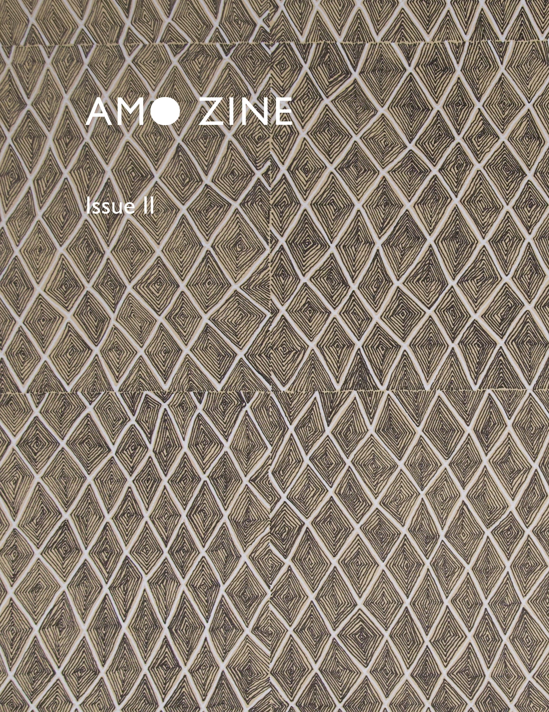
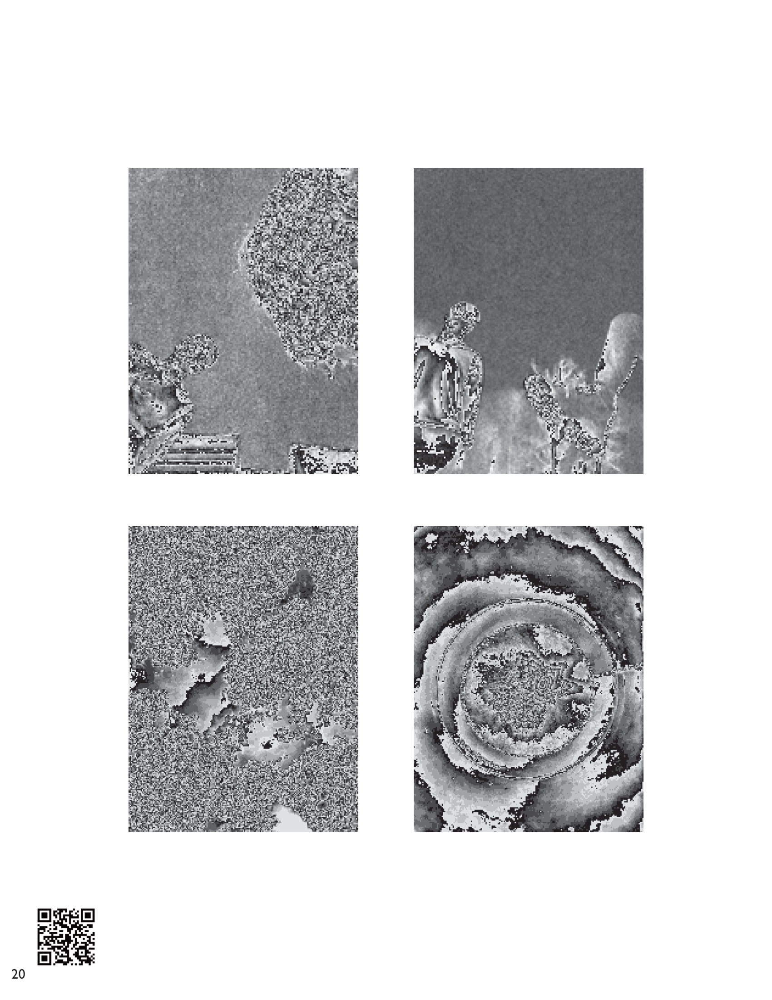

# AMO ZINE Issue II Feature (2021)

Beginning in 2020, the Art Majors' Organization student group within
Cornell University's College of Architecture, Art, and Urban Planning has
released an annual ZINE to showcase student work.

Select images from the [mod](/artworks/2021-03-07-mod) series were chosen to
appear in the second issue of the AMO ZINE.

More information about the effort to revive AMO through COVID-19 can be found
[here](https://www.sabrinahaertiggonzalez.com/copy-of-johnson-mueseum-coloring-bo-1).

