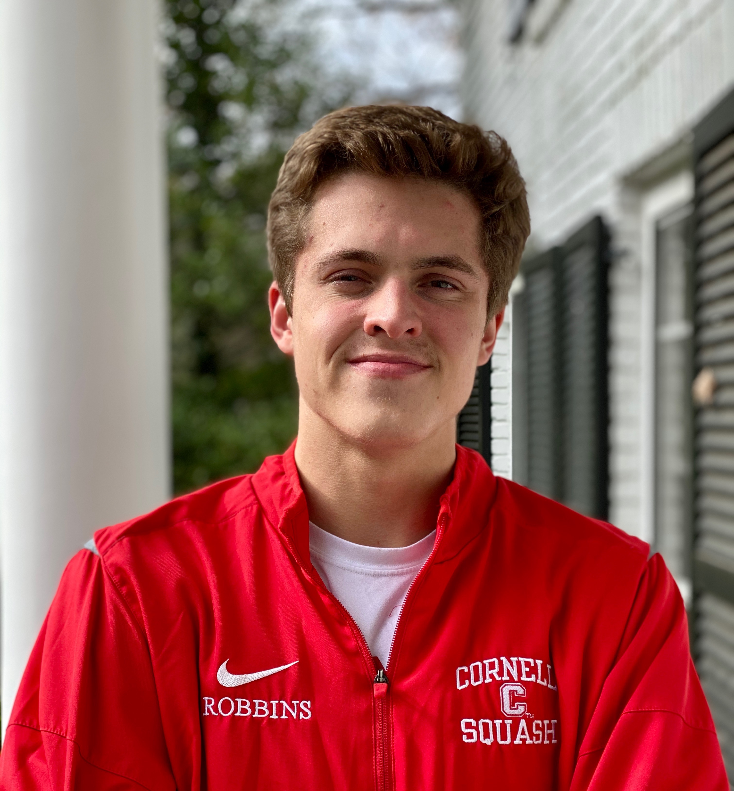

---
# Feel free to add content and custom Front Matter to this file.
# To modify the layout, see https://jekyllrb.com/docs/themes/#overriding-theme-defaults

layout: home
---

# 

I am a Cornell Engineering student studying Operations Research and Computer
Science. In Summer 2021, I was a Data Science Intern on Uber's Matching and
Shared Rides team where I developed and implemented an algorithm for
pre-scheduled rides. Prior to that, I developed course content for Cornell's
introductory Operations Research course and worked as a Data Scientist on the
Cornell Course Roster Implementation Team.

My broad research interests lie in studying applied combinatorial optimization
problems with computational components. My coursework has focused on the topics
of discrete optimization and algorithms. In recent semesters, I have also
studied how these topics can be used in imagemaking.

Outside of my studies, I am a captain on the Cornell Men's Squash Team and an
Umphreak looking forward to the next show.
